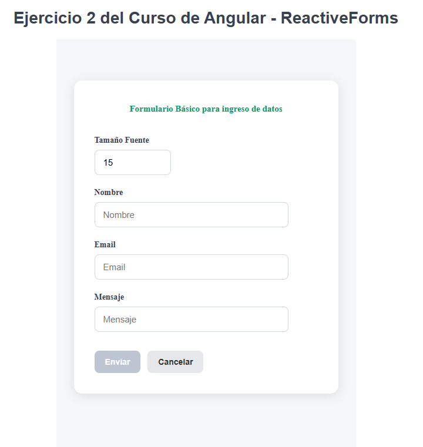
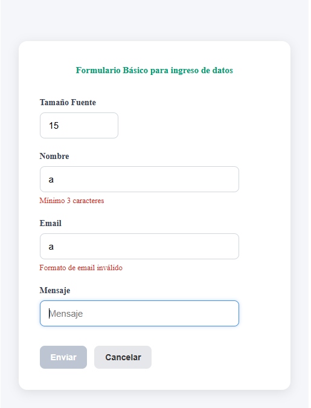
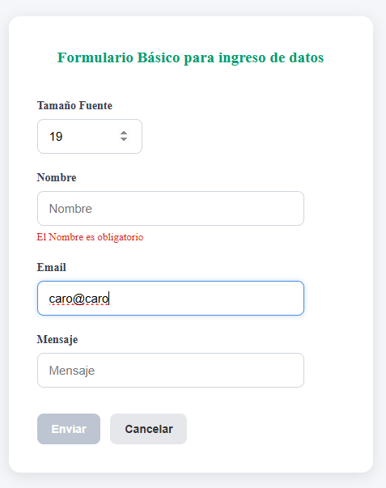
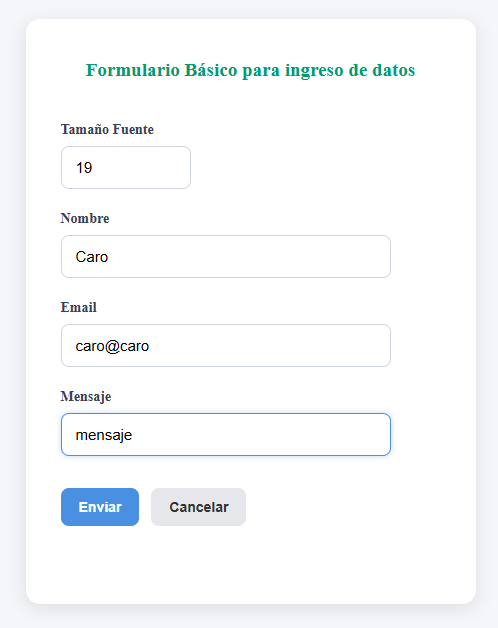
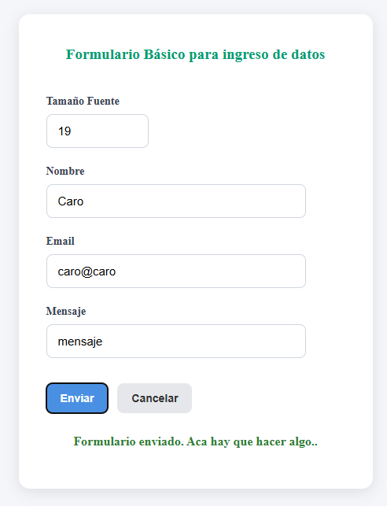

# Tarea2
Carolina Boerr
Curso Angular Mayo 2026 - Turno noche.

Reactive Forms
El formulario tiene los siguientes atributos:
- "tamanioFuente" requerido - al cambiar el valor, se modifica el tamaño del font del titulo. limitado a valores entre 15 y 50
- "nombre" - requerido - longitud minima de 3 caracteres
- "email" - requerido - valida el formato de email
- "mensaje" - texto libre sin validaciones.

- Boton "enviar": deshabilitado mientras el form está invalido. al hacer submit  muestra un mensaje en la parte inferior
- Boton "cancelar": limpia el formulario y vuelve a valores iniciales 

Screenshots

 
Se muestra en formulario con valor inicial en tamanioFuente y vacio en el resto de los atributos.

 
Luego de tocar los atributos y forzar las validaciones se muestran los mensajes de error correspondientes.

 
Mas validaciones y se muestra como al cambiar el valor de tamanioFuente cambia el tamaño del titulo

Se muestra el form válido sin mensajes de error.

Estado del formulario luego del submit

  
