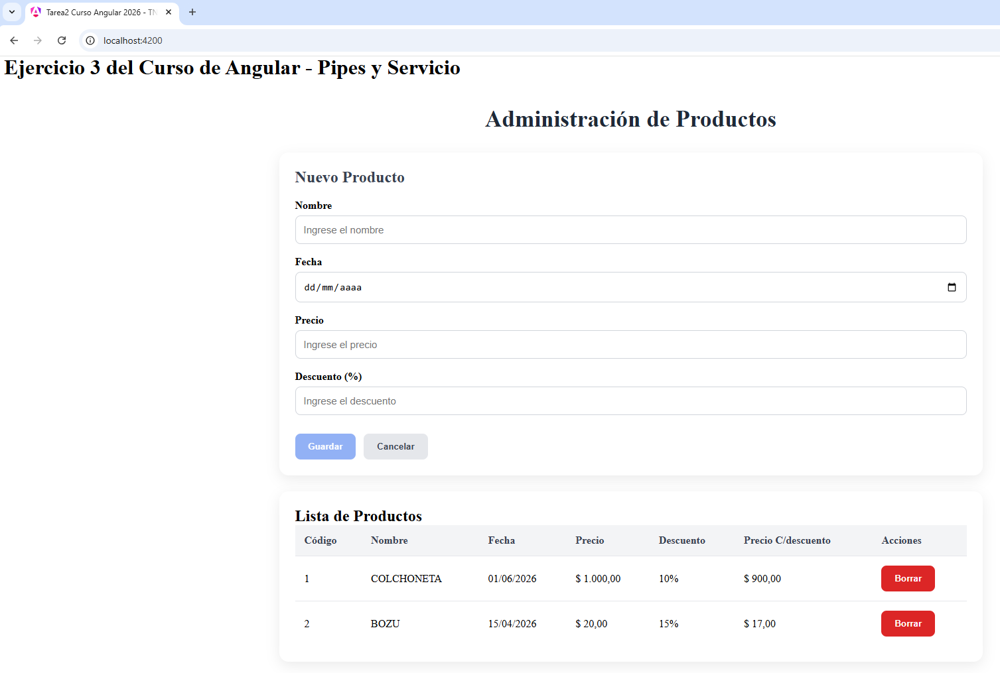
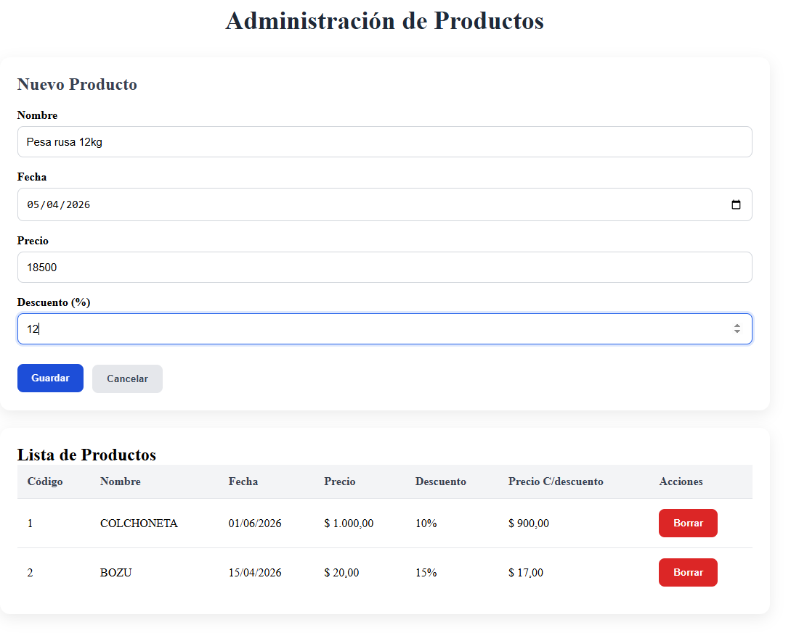
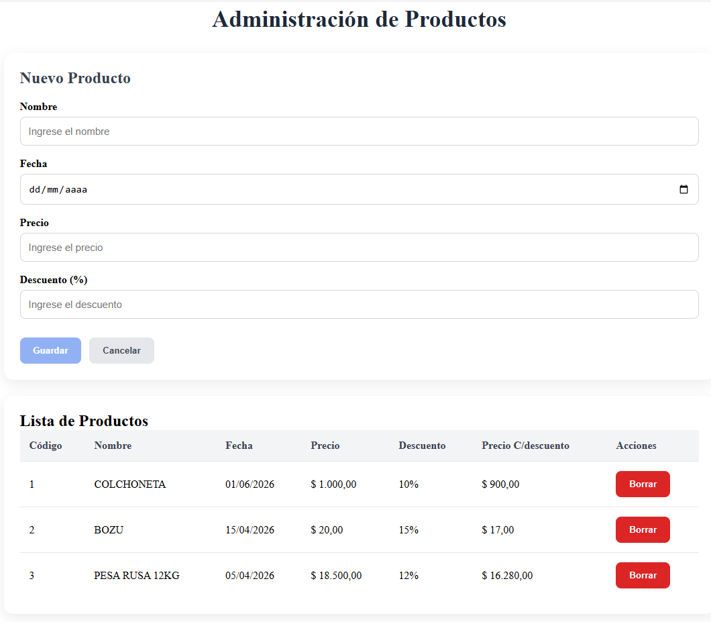
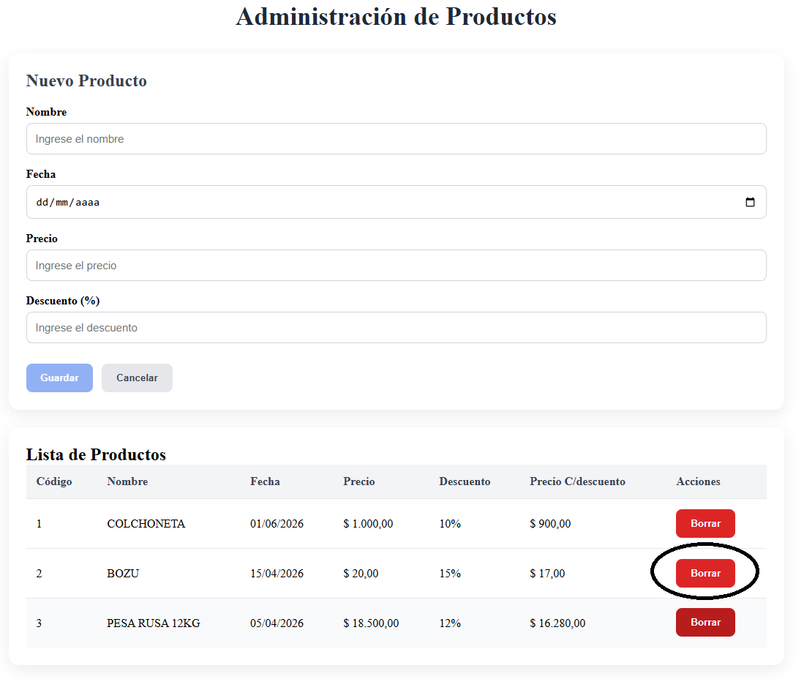
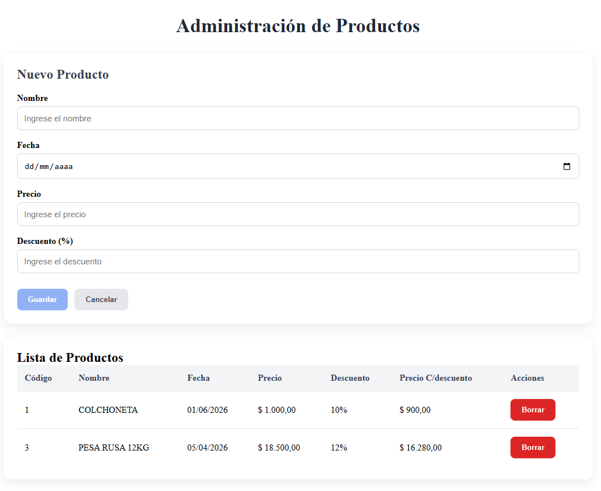

Tarea 3 - Servicios y Pipes

# Objetivos
Aplicar el concepto de servicio en Angular para manejar datos desde una API (simulada o real).
Utilizar pipes estándar y personalizados para transformar información antes de presentarla.

## Implementación

- Alta de productos mediante formulario.
- Visualización de productos en una tabla.
- Eliminación de productos.
- Actualización automática de la lista luego de agregar o eliminar registros.
- Formateo de datos utilizando pipes de Angular y pipes personalizados.

## Estructura del Proyecto

### Producto

Se define una interfaz Producto que representa la estructura de los datos administrados por la aplicación.

export interface Producto {
  id: number;
  nombre: string;
  precio: number;
  descuento: number;
}

### ProductosComponent
Es el componente principal encargado de coordinar la aplicación.

#### Responsabilidades:

- Obtener la lista de productos desde el servicio.
- Recibir eventos emitidos por los componentes hijos.
- Agregar y eliminar productos.
- Mantener sincronizada la información mostrada en pantalla.

### FormProducto
Componente encargado del alta de productos.

#### Características:
- Emite un evento cuando se registra un nuevo producto.
- Permite cancelar la carga y limpiar el formulario.

### ListaProductos
Componente encargado de mostrar los productos registrados.

#### Características:
- Recibe la lista mediante un input().
- Utiliza la directiva @for para mostrar las filas de la tabla.
- Emite eventos de eliminación mediante output().
- En la visualizacion de los datos, se utilizan los pipes currency y descuentoPipe para mostrar los datos formateados

### ProductosService
Servicio responsable de administrar los datos de la aplicación.

#### Responsabilidades:

- Almacenar la lista de productos.
- Agregar nuevos productos.
- Eliminar productos existentes.
- Proveer los datos a los componentes que los requieran.

### Comunicación entre Componentes

- Se utiliza input() para enviar información desde ProductosComponent hacia ListaProductos.
- Se utiliza output() para emitir eventos desde los componentes hijos hacia el componente principal.

### Flujo Completo de la Aplicación

                   ┌─────────────────────┐
                   │ ProductosService    │
                   └─────────┬───────────┘
                             │
               obtiene/agrega/elimina
                             │
                             ▼
                   ┌─────────────────────┐
                   │ ProductosComponent  │
                   │       (Padre)       │
                   └───────┬───── ┬──────┘
                           │      │
            Input          │      │ Output
                           │      │
                           ▼      ▲
                 ┌───────── ────┐ │
                 │ListaProductos│ │
                 └────────── ───┘ │
                                  │
                                  │
                           ┌─── ──┴─────┐
                           │FormProducto│
                           └──── ───────┘

## Capturas de pantalla
### Inicio

 

Se visualiza el formulario vacío y la lista de productos inicial.
Los datos formateados con pipes
- nombre | uppercase
- fecha | date :'dd/MM/yyyy'
- precio | currency:'$':'symbol':'1.2-2'
- La columna "Precio C/descuento" utiliza el pipe personalizado descuentoPipe y el pipe | currency:'$':'symbol':'1.2-2'
---
 

Muestra el formulario con datos cargados, listos para ser agregados a la lista de productos.
---
 

Muestra el formulario vacío luego de insertar el producto. 
En la lista de productos se visualiza el nuevo producto.
---
 

Se muestra la lista de productos con 3 productos (los 2 iniciales + el producto creado)
Es la previa a la eliminacion de 1 registro.
---
 

Se muestra la lista con todos los registros menos el eliminado.

